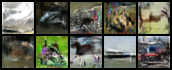
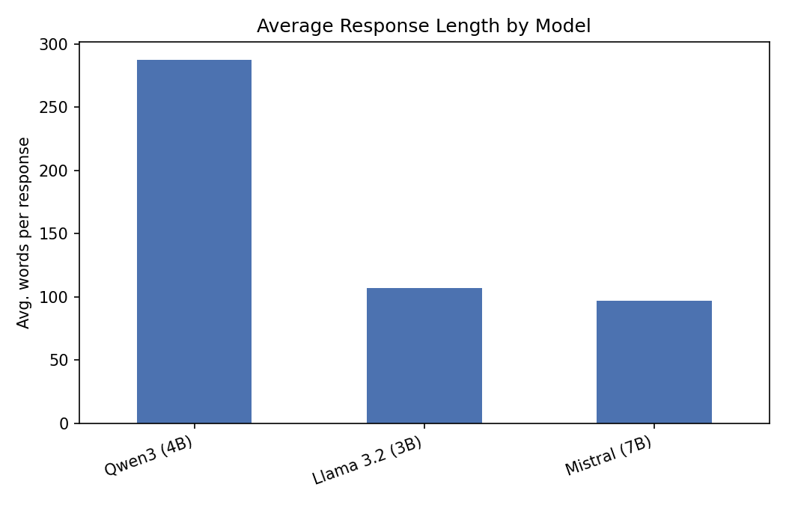
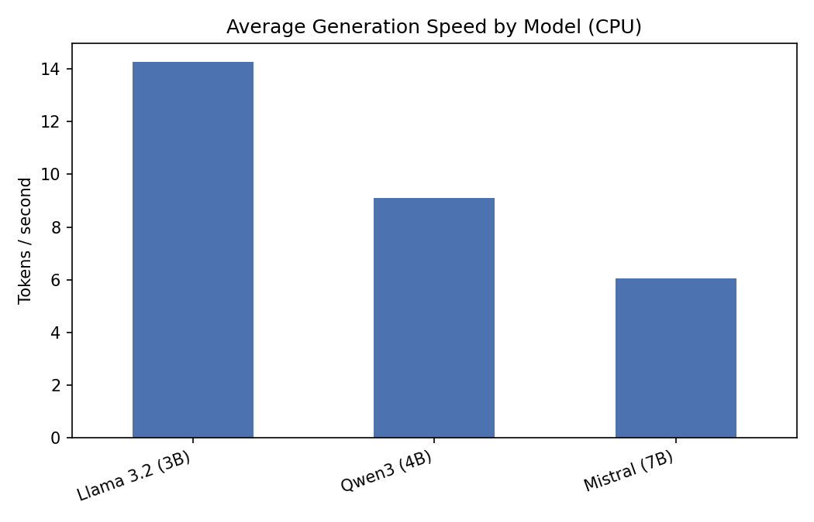
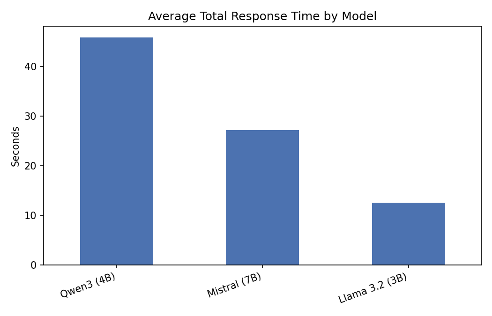
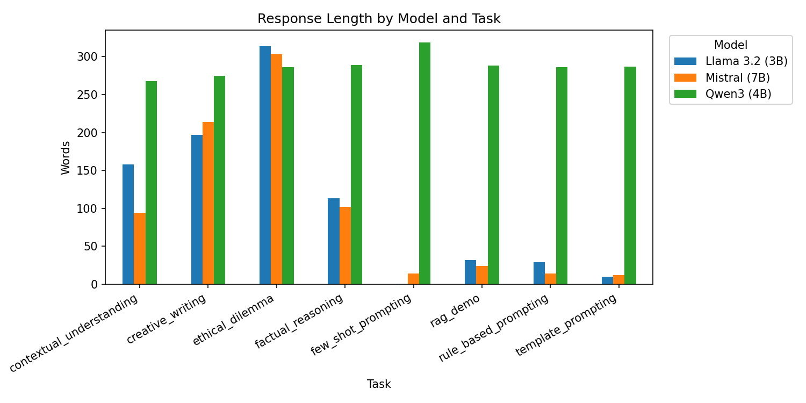

<div align="center">

# Pantheon Lab Programming Assignment

</div>

---

## Part 1 — GAN MNIST: Observations & Implementation Notes

### Environment Setup

**Difficulty 1 — `jupyterlab` install failure**

Running `pip install -r requirements.txt` on the provided `pantheon-py38` (Python 3.8) conda environment failed because `jupyterlab`'s build chain pulls in `puccinialin`, which requires Python ≥ 3.9:

```
ERROR: Could not find a version that satisfies the requirement puccinialin (from versions: none)
ERROR: No matching distribution found for puccinialin
```

`jupyterlab` is not used anywhere in the codebase (no `.ipynb` notebooks, no code imports), so it was commented out in `requirements.txt`.

**Difficulty 2 — SSL error when downloading MNIST**

After fixing the install, `trainer.fit()` crashed during `MNISTDataModule.prepare_data()` with:

```
ssl.SSLError: [ASN1: NOT_ENOUGH_DATA] not enough data (_ssl.c:4194)
```

Python's `ssl` module on this Windows + conda 3.8 setup crashes while loading the system CA store, even when `SSL_CERT_FILE` is pointed at the certifi bundle. The fix was to force-replace the default HTTPS context in `mnist_datamodule.py` before any download occurs:

```python
import ssl, certifi
ssl._create_default_https_context = lambda: ssl.create_default_context(cafile=certifi.where())
```

`certifi` and `requests` were added to `requirements.txt`.

---

### Implementation

| Area | What was done |
|------|--------------|
| **Hydra config** | Filled in `configs/model/mnist_gan_model.yaml` — instantiated `Generator` and `Discriminator` via `_target_` with OmegaConf relative interpolation (`${..n_classes}` etc.) so all shared params stay single-sourced |
| **GAN training step** | Implemented alternating generator / discriminator optimisation in `step()` using `optimizer_idx`; discriminator uses `.detach()` on generator output to prevent gradient leakage |
| **W&B logging** | Loss scalars (`g_loss`, `d_loss`, `d_real_loss`, `d_fake_loss`) logged each step via `self.log_dict`; `on_epoch_end` logs a `torchvision.make_grid` image (2 rows × 5 cols, one digit class per cell) to W&B at `step=self.current_epoch` |
| **Test evaluation** | Implemented `test_step` and made `trainer.test()` explicit in `train.py`, loading from the best checkpoint when available |
| **Training length** | Set `max_epochs: 20` and `max_steps: -1` in the experiment config; aligned `ModelCheckpoint.every_n_train_steps` to ~1 checkpoint per epoch (1720 steps) instead of the original 10 000 |

---

### AI Suggestions Rejected / Corrected

1. **Adding `certifi` + `requests` to requirements alone** — AI suggested this would fix the SSL error, but installing the packages without patching the default context had no effect (`urllib` still loaded the broken Windows cert store). Rejected; the actual fix required monkey-patching `ssl._create_default_https_context` in the datamodule.

2. **Bumping `max_epochs` from 10 → 20 without `max_steps: -1`** — AI made the epoch change but left an implicit step ceiling in place. Rejected as incomplete; required explicitly setting `max_steps: -1` to ensure epoch count alone governs training length.

---

### Results — 20-Epoch Run

**Final metrics (W&B run summary)**

| Metric | Train | Test |
|--------|-------|------|
| `g_loss` | 0.367 | 0.393 |
| `d_loss` | 0.194 | 0.228 |
| `d_real_loss` | 0.198 | 0.303 |
| `d_fake_loss` | 0.191 | 0.152 |
| `global_step` | 17 200 | — |

**Loss curves**


Generator loss (`train/g_loss`) and discriminator loss (`train/d_loss`) both decrease and stabilise after ~5 k steps, indicating the training converged. The near-equal `d_real_loss` and `d_fake_loss` at the end of training shows the discriminator is roughly balanced between real and generated samples.

**Generated samples progression**

| Early training | Mid training | Epoch 20 (final) |
|:-:|:-:|:-:|
|  |  |  |

Each grid shows one generated sample per digit class (0–9), arranged in two rows. Digit structure becomes clearly recognisable by epoch 20, consistent with the example in the assignment brief.

---

## Part 2 — Open-Ended Tasks: CNN Conditional GAN on CIFAR-10

Staying within the Hydra / PyTorch-Lightning / W&B framework, the MNIST GAN was extended along three of the suggested open-ended directions at once:

1. **Own CNN networks** — replaced the MLP generator/discriminator with a DCGAN-style conditional CNN pair
2. **More complex dataset** — swapped grayscale MNIST for colour CIFAR-10 (RGB, 32×32, 10 classes)
3. **Added plugin/dependency** — integrated `torchmetrics` to track discriminator accuracy

Everything was added as new, additive components (no existing MNIST files were changed) and wired together purely through new Hydra configs, so both experiments (`train_mnist_gan.yaml` and `train_cifar10_gan.yaml`) remain runnable side by side.

### Implementation

| Area | What was done |
|------|--------------|
| **CNN Generator** (`src/models/modules/cnn_generators.py`) | Noise + label embedding → `Linear` → reshape to `(256, 4, 4)` → 3× `ConvTranspose2d` blocks (4→8→16→32) → `Tanh`, producing `(3, 32, 32)` RGB images |
| **CNN Discriminator** (`src/models/modules/cnn_discriminators.py`) | Label embedding reshaped to a `(1, 32, 32)` spatial map and concatenated as an extra image channel (spatial conditioning, works better with convolutions than the MLP's channel-concat-after-flatten); 3× `Conv2d` blocks (32→16→8→4) → `Linear` → 1 logit |
| **CIFAR-10 DataModule** (`src/datamodules/cifar10_datamodule.py`) | Mirrors `MNISTDataModule` structure; 3-channel normalisation `[0.5]*3`; same certifi/SSL fix applied since `torchvision.datasets.CIFAR10` hit the identical Windows CA-store error |
| **`CIFAR10GANModel`** (`src/models/cifar10_gan_model.py`) | Subclasses `MNISTGANModel` — inherits the alternating-optimisation `step()` logic unchanged; overrides `validation_step` to additionally track a `torchmetrics.Accuracy(task="binary")` discriminator accuracy metric, and overrides `on_epoch_end` for RGB-aware grid logging |
| **Hydra configs** | New `configs/model/cifar10_gan_model.yaml`, `configs/datamodule/cifar10_datamodule.yaml`, `configs/experiment/train_cifar10_gan.yaml` — run with `python run.py experiment=train_cifar10_gan.yaml` |


### Results — 30-Epoch Run (RTX 5060 Ti)

**Final metrics (W&B run summary)**

| Metric | Train | Val | Test |
|--------|-------|-----|------|
| `g_loss` | 1.139 | 0.692 | 0.523 |
| `d_loss` | 0.018 | 0.206 | 0.178 |
| `d_real_loss` | 0.019 | 0.360 | 0.260 |
| `d_fake_loss` | 0.017 | 0.052 | 0.096 |
| `disc_acc` | — | 0.556 | — |
| `global_step` | 22 360 | — | — |

The very low `train/d_loss` (0.018) vs. much higher `val/d_loss` (0.206) shows the discriminator overfits on training data faster than on CIFAR-10's more complex, colourful images — expected, since natural-image textures are far harder to model than MNIST strokes. `val/disc_acc` of ~0.56 (barely above chance) shows the generator was strong enough by the end to regularly fool the discriminator, which is the desired GAN equilibrium behaviour rather than a training failure.

**Generated samples progression**

| Epoch 0 | Mid-training | Final (epoch 29) |
|:-:|:-:|:-:|
|  |  |  |

At epoch 0 the generator outputs pure colour noise (no structure). By mid-training, blurry blob-like shapes with plausible colour distributions (greens, blues, browns) start to emerge. By the final epoch, recognisable coarse silhouettes of vehicles and animals appear against varied backgrounds — a reasonable result for a simple DCGAN trained on CPU/consumer GPU for 30 epochs; sharper detail would need more capacity, more epochs, and techniques like spectral normalisation or a stronger loss (e.g. WGAN-GP).

---

## Part 3 — Chatbot Assignment: Local LLM Comparison

Three local instruction-tuned models were compared through Ollama using CPU-only inference (`num_gpu: 0`):

- Llama 3.2 (3B)
- Mistral (7B)
- Qwen3 (4B)

The Hydra-driven test harness ran the same eight prompts against each model and saved the complete prompts, parameters, unedited responses, and timing metadata as individual JSON files under [`chatbot_comparison/result/raw`](./chatbot_comparison/result/raw). The results were then aggregated into [`llm_comparison.xlsx`](./chatbot_comparison/result/llm_comparison.xlsx).

### Comparison

| Dimension | Llama 3.2 (3B) | Mistral (7B) | Qwen3 (4B) |
|-----------|-----------------|--------------|-------------|
| **Content quality** | Misread “all but 9 die” as 9 deaths and returned **32** | Made the same parsing error and returned **32** | Correctly reasoned that 9 remain and the total becomes **36**, but hit the token limit before presenting a concise final answer |
| **Context retention** | Retained the peanut/shellfish constraint and addressed Alex by name; 158 words | Retained the constraint and was most concise; 94 words | Retained the constraint, but buried the answer in approximately 268 words of planning |
| **Language fluency** | Vivid, readable prose | Most polished phrasing, including “a siren's song that pierced the storm's symphony” | Returned planning notes instead of the requested story, including “Word count alert: Draft is 187 words” |
| **Ethical reasoning** | Considered multiple perspectives with a utilitarian leaning | Most structured response; explicitly organised the issue around three ethical frameworks | Identified relevant trade-offs but spent the full output budget planning and was cut off before a conclusion |
| **Average length / speed** | 107 words; **14.3 tokens/s** (fastest) | 97 words; **6.0 tokens/s** (slowest) | 287 words; **9.1 tokens/s** |

The riddle result is especially instructive: shorter output did not guarantee correctness. Llama and Mistral confidently mishandled the phrase “all but 9,” whereas Qwen reached the correct calculation but failed to package it into a completed answer.

### Main Takeaway

Llama and Mistral were generally concise and usable, with Mistral producing the strongest prose and most structured ethical discussion. However, both failed the factual riddle. Qwen showed useful intermediate reasoning and reached the correct riddle calculation, but repeatedly exposed chain-of-thought-style planning in its visible response. This verbosity caused it to violate output formats and reach the 400-token limit before completing several tasks.

Although the Ollama request recorded `think: false` for Qwen, the model still emitted planning text and even a stray `</think>` marker. Therefore, this behaviour is described as **visible reasoning leakage**, not enabled hidden thinking.

### Generation Parameters

- **Temperature:** Llama used `0.2`, while Mistral and Qwen used `0.7`. Lower temperature generally produces more deterministic, conservative output; higher temperature permits more varied phrasing. Because this parameter was not held constant, the comparison is observational rather than a perfectly controlled model-only benchmark.
- **`top_p: 0.9`:** limited sampling to tokens within the top 90% cumulative probability mass.
- **`top_k: 40`:** limited each sampling step to the 40 most probable candidate tokens.
- **`num_predict: 400`:** imposed a hard output-token cap. Qwen reached this limit repeatedly, causing incomplete or mid-sentence responses.
- **`think: false`:** explicitly requested non-thinking output. Llama and Mistral responded normally; Qwen still produced visible planning text.
- **`seed: 42`:** fixed to improve reproducibility.
- **`num_gpu: 0`:** forced all models to run locally on CPU.

### Prompt-Engineering Techniques

**Template-based prompting.** The prompt supplied an exact JSON template. Llama and Mistral immediately returned valid structured data. Qwen repeatedly reconsidered whether the placeholder `null` should remain unchanged and exhausted its output budget without producing the JSON. Templates are easy to validate automatically, but only when the model obeys the requested output boundary.

**Rule-based prompting.** The prompt required exactly three bullets, at most ten words each, with different first words. Llama and Mistral followed the constraints cleanly. Qwen began analysing the rules instead of directly applying them and was truncated. Explicit rules make compliance measurable, but verbose reasoning can prevent the model from reaching the requested answer.

**Few-shot prompting.** Three labelled sentiment examples established the task and expected one-word output. Llama returned the required single label. Mistral selected a label but added an explanation, violating the format. Qwen analysed the mixed sentiment at length and never reached its final label. Few-shot examples improve task understanding, but do not guarantee format compliance.

Overall, template- and rule-based prompts were precise and easy to score, but brittle when a model exposed long reasoning traces. Few-shot prompting encouraged more nuanced interpretation, yet still required strict output controls.

### Retrieval-Augmented Generation (RAG)

RAG combines two stages:

1. A **retriever** searches an external knowledge source for passages relevant to the user's query.
2. A **generator** receives those passages as context and produces an answer grounded in the retrieved evidence.

This reduces reliance on model memory, allows answers to use private or current information, and makes hallucinations easier to control. The test simulated the generation stage by injecting a fabricated passage about Pantheon Lab's GPU cluster, then instructing each model to answer using only that passage.

Llama and Mistral correctly extracted both facts: **12 NVIDIA A100 GPUs**, reserved through the **`#gpu-booking` Slack bot**. Qwen also identified both facts in its planning, but its visible final answer was truncated after “There are 1,” again demonstrating that correct internal extraction is not enough when output control fails.

### Quantitative Visualisation

| Response length | CPU generation speed |
|:-:|:-:|
|  |  |

| Total response time | Length by task |
|:-:|:-:|
|  |  |

---

<div align="center">

<a href="https://pytorch.org/get-started/locally/"></a>
<a href="https://pytorchlightning.ai/"></a>
<a href="https://hydra.cc/"></a>
<a href="https://github.com/ashleve/lightning-hydra-template"></a><br>

</div>

AI assistance is allowed and expected. Submit the complete raw session export or native
conversation log produced by your AI tool, and identify at least 3 moments where you
rejected, corrected, or substantially reworked an AI suggestion.

## What is all this?
This "programming assignment" is really just a way to get you used to
some of the tools we use every day at Pantheon to help with our research.

There are 4 fundamental areas that this small task will have you cover:

1. Getting familiar with training models using [pytorch-lightning](https://pytorch-lightning.readthedocs.io/en/latest/starter/new-project.html)

2. Using the [Hydra](https://hydra.cc/) framework

3. Logging and reporting your experiments on [weights and biases](https://wandb.ai/site)

4. Showing some basic machine learning knowledge

## What's the task?
The actual machine learning task you'll be doing is fairly simple! 
You will be using a very simple GAN to generate fake
[MNIST](https://pytorch.org/vision/stable/datasets.html#mnist) images.

We don't excpect you to have access to any GPU's. As mentioned earlier this is just a task
to get you familiar with the tools listed above, but don't hesitate to improve the model
as much as you can!

## What you need to do

To understand how this framework works have a look at `src/train.py`. 
Hydra first tries to initialise various pytorch lightning components: 
the trainer, model, datamodule, callbacks and the logger.

To make the model train you will need to do a few things:

- [ ] Complete the model yaml config (`model/mnist_gan_model.yaml`)
- [ ] Complete the implementation of the model's `step` method
- [ ] Implement logging functionality to view loss curves 
and predicted samples during training, using the pytorch lightning
callback method `on_epoch_end` (use [wandb](https://wandb.ai/site)!) 
- [ ] Answer some questions about the code (see the bottom of this README)

**All implementation tasks in the code are marked with** `TODO`

Don't feel limited to these tasks above! Feel free to improve on various parts of the model

For example, training the model for around 20 epochs will give you results like this:


## Getting started
After cloning this repo, install dependencies
```yaml
# [OPTIONAL] create conda environment
conda create --name pantheon-py38 python=3.8
conda activate pantheon-py38

# install requirements
pip install -r requirements.txt
```

Train model with experiment configuration
```yaml
# default
python run.py experiment=train_mnist_gan.yaml

# train on CPU
python run.py experiment=train_mnist_gan.yaml trainer.gpus=0

# train on GPU
python run.py experiment=train_mnist_gan.yaml trainer.gpus=1
```

You can override any parameter from command line like this
```yaml
python run.py experiment=train_mnist_gan.yaml trainer.max_epochs=20 datamodule.batch_size=32
```

The current state of the code will fail at
`src/models/mnist_gan_model.py, line 29, in configure_optimizers`
This is because the generator and discriminator are currently assigned `null`
in `model/mnist_gan_model.yaml`. This is your first task in the "What you need to do" 
section.

## Open-Ended tasks (Bonus for junior candidates, expected for senior candidates)

Staying within the given Hydra - Pytorch-lightning - Wandb framework, show off your skills and creativity by extending the existing model, or even setting up a new one with completely different training goals/strategy. Here are a few potential ideas:

- **Implement your own networks**: you are free to choose what you deem most appropriate, but we recommend using CNN and their variants if you are keeping the image-based GANs as the model to train
- **Use a more complex dataset**: ideally introducing color, and higher resolution
- **Introduce new losses, or different training regimens**
- **Add more plugins/dependecy**: on top of the provided framework
- **Train a completely different model**: this may be especially relevant to you if your existing expertise is not centered in image-based GANs. You may want to re-create a toy sample related to your past research. Do remember to still use the provided framework.

## Questions

Try to prepare some short answers to the following questions below for discussion in the interview.

* What is the role of the discriminator in a GAN model? Use this project's discriminator as an example.

* The generator network in this code base takes two arguments: `noise` and `labels`.
What are these inputs and how could they be used at inference time to generate an image of the number 5?

* What steps are needed to deploy a model into production?

* If you wanted to train with multiple GPUs, 
what can you do in pytorch lightning to make sure data is allocated to the correct GPU? 

## Submission

- Using git, keep the existing git history and add your code contribution on top of it. Follow git best practices as you see fit. We appreciate readability in the commits
- Add a section at the top of this README, containing your answers to the questions, as well as the output `wandb` graphs and images resulting from your training run. You are also invited to talk about difficulties you encountered and how you overcame them
- Link to your git repository in your email reply and share it with us/make it public

## Chatbot Assignment

Compare at least **3 LLMs**, each running locally on your device through
[Ollama](https://ollama.com/) or another local model server suitable for your hardware. A GPU is not required.

For the model-comparison evidence, record each model, complete prompt (including relevant
system instructions), parameter settings, and unedited response. Clearly label each test
so it can be matched to your analysis, and do not include API keys or other secrets.

- Compare the models across content quality, contextual understanding, language fluency,
  and ethical considerations. Support your conclusions with examples from your tests.
- Explain the parameters used to control model responses and how each affects behavior.
- Explore prompt-engineering techniques such as template-based, rule-based, and
  machine-learning-based prompting. Discuss their challenges and trade-offs with examples.
- Explain retrieval-augmented generation (RAG) and how it is applied to natural-language
  generation tasks.

<br>
